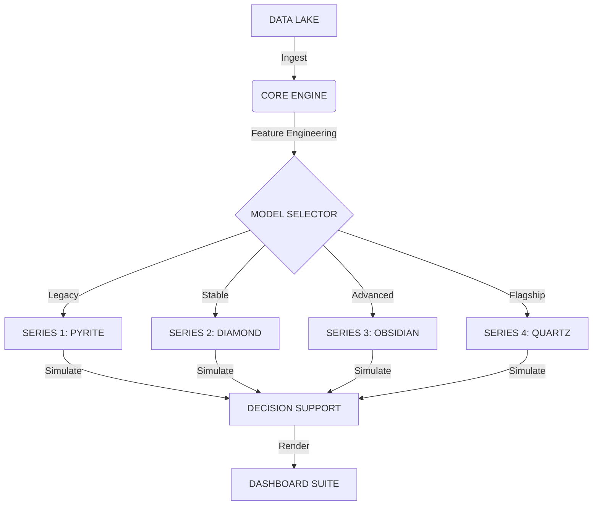

   
  <h1>QUARRY INTELLIGENCE</h1>
  
INSTITUTIONAL ALGORITHMIC ANALYTICS

   

  
  
  

   
   
  <a href="https://ducky705.github.io/Quarry-Intelligence/selector.html"><strong>ACCESS CONTROL CENTER</strong></a>
   
   

---

## ⚡ EXECUTIVE INTELLIGENCE

A multi-generational algorithmic trading system leveraging **Gradient Boosting Decision Trees (XGBoost)** and **Deep Neural Networks** to identify inefficiencies in sports betting markets.

| MODEL ARCHITECTURE | RELEASED | STRATEGY PROFILE | STATUS | VOLUME | TOTAL SAMPLES | ROI |
| :--- | :--- | :--- | :--- | :--- | :--- | :--- |
| **[SERIES 1: PYRITE](https://ducky705.github.io/Quarry-Intelligence/pyrite.html)** | `NOV 20, 2025` | `LEGACY CORE`   High-Freq | 🟡 **LEGACY** | Low (~5/day) | **778** | **-3.2%** |
| **[SERIES 2: DIAMOND](https://ducky705.github.io/Quarry-Intelligence/diamond.html)** | `NOV 30, 2025` | `PRECISION CORE`   Refined | 🟢 **STABLE** | Low (~7/day) | **990** | **+11.3%** |
| **[SERIES 3: OBSIDIAN](https://ducky705.github.io/Quarry-Intelligence/obsidian.html)** | `DEC 27, 2025` | `ADVANCED ENSEMBLE`   Non-Linear | 🟣 **ADVANCED** | Medium (~11/day) | **1165** | **-1.8%** |
| **[SERIES 4: QUARTZ](https://ducky705.github.io/Quarry-Intelligence/quartz.html)** | `APR 06, 2026` | `INSTITUTIONAL`   Drift Proxy | ⚪ **FLAGSHIP** | Medium (~5/day) | **11** | **+9.6%** |

> [!IMPORTANT]
> **ACCESS PROTOCOL**: The primary interface for all models is the [**Model Selector**](https://ducky705.github.io/Quarry-Intelligence/selector.html).

---

## 🛰 SYSTEMS OVERVIEW

### SERIES 4: QUARTZ // INSTITUTIONAL FLAGSHIP
*Institutional-grade research model.* Utilizes signal consensus to identify opening market inefficiencies.
*   **Mechanism**: Systematic drift analysis with cap-weighted pooling.
*   **Performance**: Optimized for high stability and low drawdown.

### SERIES 2: DIAMOND // PRECISION CORE
*Standard precision model.* Focuses on market volatility filtering to optimize risk-adjusted returns.
*   **Mechanism**: Implements advanced outlier rejection and regime detection.
*   **Performance**: Reliable alpha generation in stable market conditions.

---

## 🛠 ARCHITECTURE

---

    
<em>© 2026 QUARRY INTELLIGENCE GROUP // PROPRIETARY RESEARCH</em>

