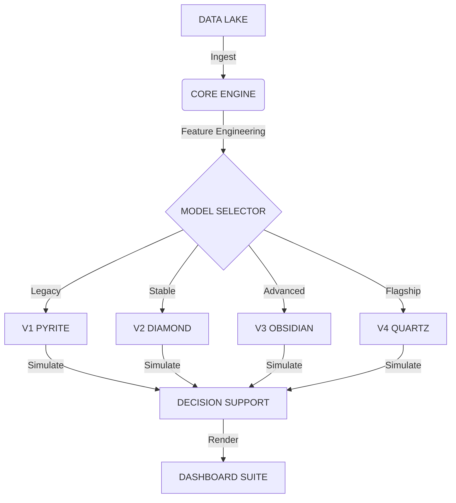

   
  <h1>QUARRY INTELLIGENCE</h1>
  
INSTITUTIONAL ALGORITHMIC ANALYTICS

   

  
  
  

   
   
  <a href="https://ducky705.github.io/Quarry-Intelligence/selector.html"><strong>ACCESS CONTROL CENTER</strong></a>
   
   

---

## ⚡ EXECUTIVE INTELLIGENCE

A multi-generational algorithmic trading system leveraging **Gradient Boosting Decision Trees (XGBoost)** and **Deep Neural Networks** to identify inefficiencies in sports betting markets.

| MODEL ARCHITECTURE | RELEASED | STRATEGY PROFILE | STATUS | VOLUME | TOTAL BETS | ROI |
| :--- | :--- | :--- | :--- | :--- | :--- | :--- |
| **[SERIES 1: PYRITE](https://ducky705.github.io/Quarry-Intelligence/pyrite.html)** | `NOV 20, 2025` | `LEGACY CORE`   High-Freq | 🟡 **LEGACY** | High (~25 bets/day) | **3650** | **-4.1%** |
| **[SERIES 2: DIAMOND](https://ducky705.github.io/Quarry-Intelligence/diamond.html)** | `NOV 30, 2025` | `PRECISION CORE`   Refined | 🟢 **STABLE** | Medium (~17 bets/day) | **2327** | **+7.3%** |
| **[SERIES 3: OBSIDIAN](https://ducky705.github.io/Quarry-Intelligence/obsidian.html)** | `DEC 27, 2025` | `ADVANCED ENSEMBLE`   Non-Linear | 🟣 **ADVANCED** | Medium (~11 bets/day) | **1274** | **+6.5%** |
| **[SERIES 4: QUARTZ](https://ducky705.github.io/Quarry-Intelligence/quartz.html)** | `APR 06, 2026` | `INSTITUTIONAL`   Drift Proxy | ⚪ **FLAGSHIP** | Low (~7 bets/day) | **51** | **+17.8%** |

> [!IMPORTANT]
\> **ACCESS PROTOCOL**: The primary interface for all models is the [**Model Selector**](https://ducky705.github.io/Quarry-Intelligence/selector.html).

---

## 🛰 SYSTEMS OVERVIEW

### V4 QUARTZ // THE PRISM
*The latest flagship.* Utilizes **Correct Shift** logic to identify opening line inefficiencies across high-fidelity consensus pools.
*   **Mechanism**: Vectorized alpha harvesting with institutional drift proxy.
*   **Performance**: Targeting maximum stability and high recovery factor.

### V2 DIAMOND // THE SNIPER
*The institutional standard.* Focuses on **Regime Filtering** to avoid toxic low-predictability markets.
*   **Mechanism**: Uses a Fade Score to identify public overexposure.
*   **Performance**: Strong alpha generation with low drawdown.

---

## 🛠 ARCHITECTURE

---

    
<em>© 2026 QUARRY INTELLIGENCE GROUP // PROPRIETARY RESEARCH</em>

