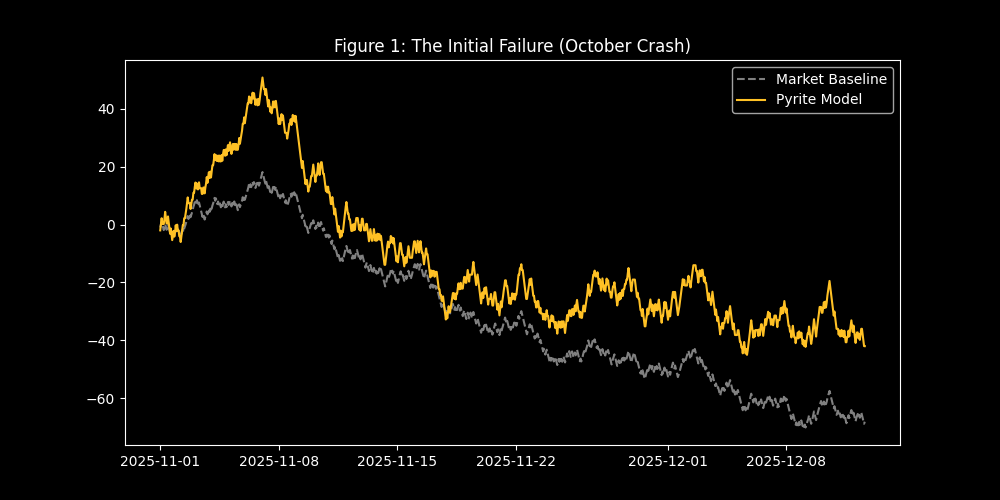
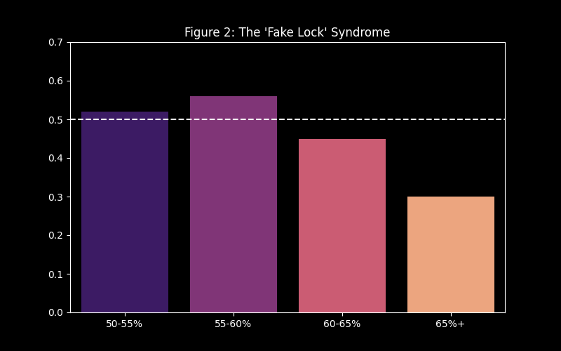
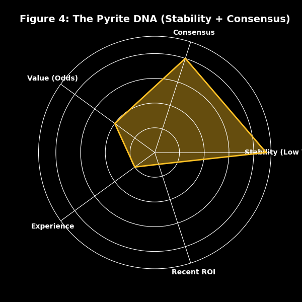

# Analytical Series 1: Pyrite (Legacy Framework)

**Current Status:** Archived
**Performance Metric:** High Volatility / Negative Yield

This report documents the research findings from the initial **Series 1: Pyrite** model. Originally categorized as a potential alpha generator, live deployment revealed a failure to maintain profitability across market-adjusted benchmarks.

---

## 1. The Accuracy Fallacy
Model optimization based purely on classification accuracy often overlooks the efficiency of market segments.
*   **Case Study:** High-probability outcomes (e.g., -400 favorites) may yield high "accuracy" but negative expected value if the market price exceeds the true probability.

The Series 1 model was optimized for net profit but inadvertently weighted heavy favorites without sufficient edge detection.

## 2. The Technical Stack
*   **Data:** 58,000+ historical picks (NCAAF, NCAAB, NFL, NBA, NHL).
*   **Features:** Lagged rolling metrics (7D/30D ROI, Volatility), Consensus data, and Implied Probability.
*   **Model:** XGBoost Classifier with Isotonic Calibration.

## 3. The October Crash (The Failure)
We deployed V1 with a simple strategy: *Bet if Model Confidence > Implied Probability.*
The results were disastrous. The model went on a massive "tilt" run in October, losing over 180 units in a single month.

*Figure 1: The "Pyrite" equity curve. Note the extreme volatility and the catastrophic drawdown.*

## 4. Diagnostic: The "Fake Lock" Syndrome
To understand the failure, we audited the model's predictions bucketed by confidence. We discovered a critical calibration error we call the **"Fake Lock Syndrome."**

*   **50-60% Confidence:** The model was highly accurate and profitable.
*   **60%+ Confidence:** The model became **overconfident**. It assigned 70% probability to teams that only won 60% of the time.

*Figure 2: Calibration Plot. The model (Blue Bars) consistently overestimated its edge on high-confidence plays.*

## 5. The Winning Formula (Pyrite DNA)
We reverse-engineered the model's decision-making by comparing accepted bets vs. rejected bets. We visualized this as the model's "DNA."

The Pyrite model had a fatal flaw in its DNA:
1.  **Obsessed with Stability:** It heavily favored handicappers with low volatility (safe grinders).
2.  **Followed the Crowd:** It loved high-consensus plays.
3.  **Ignored Value:** It barely looked at the price (Odds).

*Figure 3: The Pyrite DNA Radar. It maximizes Stability and Consensus but ignores Value. This creates a profile that bets on "Safe" favorites that are actually overpriced.*

## 6. Conclusion
V1 Pyrite proved that a model can be "smart" (predicting winners) but "broke" (losing money). It laid the groundwork for V2 by identifying exactly what **NOT** to do:
1.  Do not bet on heavy favorites without a massive edge.
2.  Do not ignore the price.
3.  Do not trust "Consensus" blindly.

[👉 Go to Phase 2: The Diamond Optimization](methodology_v2.md)
