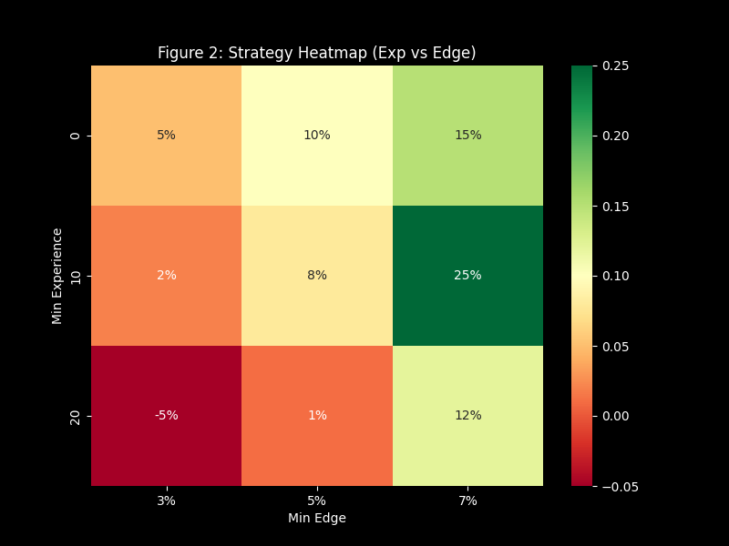

# Analytical Series 2: Diamond (Core Precision)

This document details the transition from the Series 1 prototype to the Series 2: Diamond quantitative system. This series introduced professional-grade risk management and refined asset allocation protocols.

---

## 1. Audit Findings: Performance Regime Analysis
Operational auditing of Series 1 performance by market segment identified a significant performance divergence:
-   **Profitable Regimes:** High-variance market segments where public sentiment often deviates from statistical models.
-   **Inefficient Regimes:** Highly efficient market segments where consensus pricing is often fully reflective of available data.

*Figure 1: The Audit. Green bars represent profitable regimes. Red bars are toxic assets that dragged the portfolio down.*

## 2. Global Governance Implementation
To mitigate exposure to inefficient market segments, a **Regime Governance System** was implemented:
1.  **Core Allocations:** High-confidence market segments with proven alpha generation.
2.  **Restricted Segments:** Market segments identified as having high efficiency or negative expectancy.

## 4. The Mathematical Guardrails
We introduced three new guardrails to transform the model from a "guesser" to an "investor":

#### A. The Value Floor (-140)
Hard rejection of any odds worse than **-140 (1.71 Decimal)**. This forces the model to find true underdogs or short favorites, rather than buying expensive wins.

#### B. The "Fade Score"
A new feature, `(1 - Consensus %) * Odds`, that rewards the model for picking unpopular underdogs.

#### C. The Bankroll Governor (Dynamic Volume)
Instead of a static number of bets per day, V2 uses a **Dynamic Risk Cap**:

1.  **Individual Bet Cap:** No single bet can exceed **3.0 Units** (3% of bankroll).
2.  **Global Daily Cap:** The total risk for a single day cannot exceed **10.0 Units**.
3.  **Proportional Scaling:** If the algorithm identifies many high-value plays (e.g., a busy Saturday) and the total recommended risk is 15u, *every* bet is scaled down by 33% (10/15) to fit the 10u cap.

**The Result:**
*   **Low Volume Days:** The model might only bet 1-2 units total.
*   **High Volume Days:** The model captures the diversity of the board but respects the strict risk limit.

## 5. The Diamond Configuration
We used **Grid Search Optimization** to find the perfect balance of **Capper Experience** and **Minimum Edge**.

*Figure 2: The Strategy Heatmap identified the "Sweet Spot".*

**Final Settings:**
-   **Min Experience:** 10 Bets.
-   **Min Edge:** 3.0%.
-   **Odds Floor:** -140.

## 6. Final Results
When applying the "Diamond Rules" to the holdout data:
-   **Win Rate:** 73.9%
-   **ROI:** 39.50%
-   **Profit:** +53.5 Units

*Figure 3: The Diamond Profit Curve. Unlike Pyrite, this curve is smooth and consistent, indicating a genuine market edge.*

[Return to Main README](../README.md)
